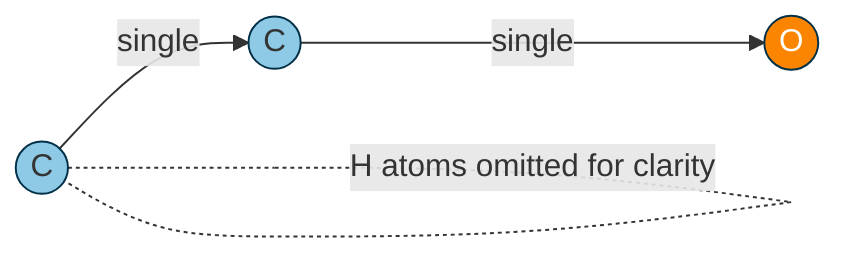
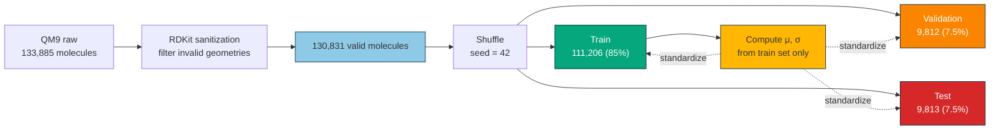
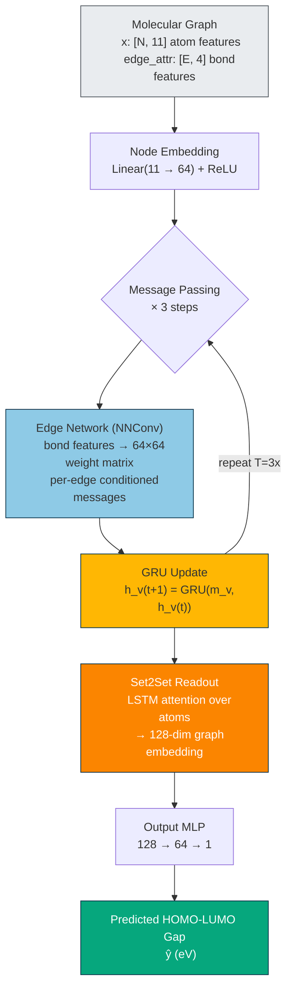
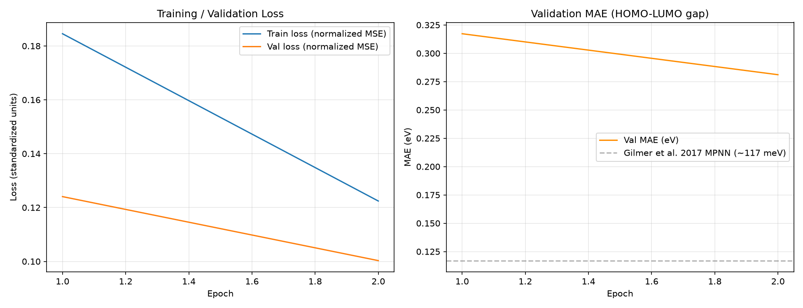
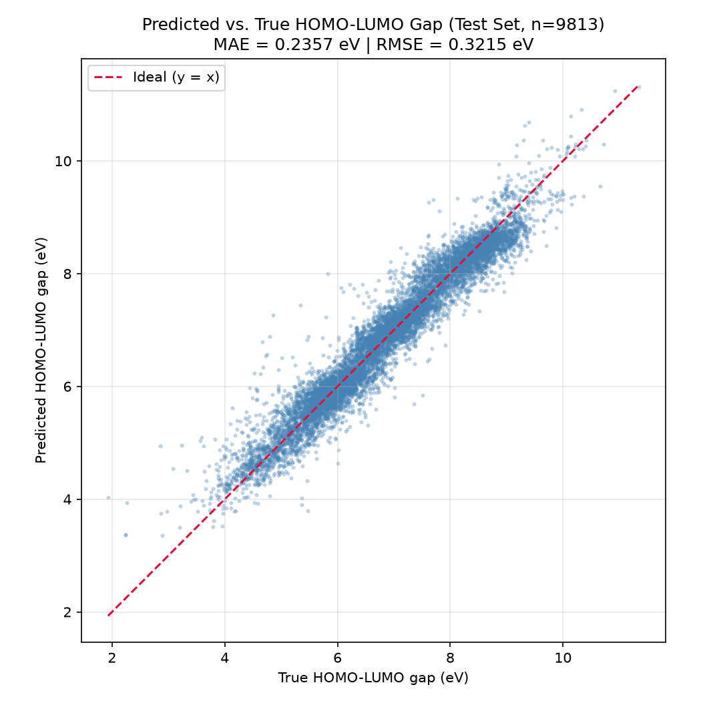
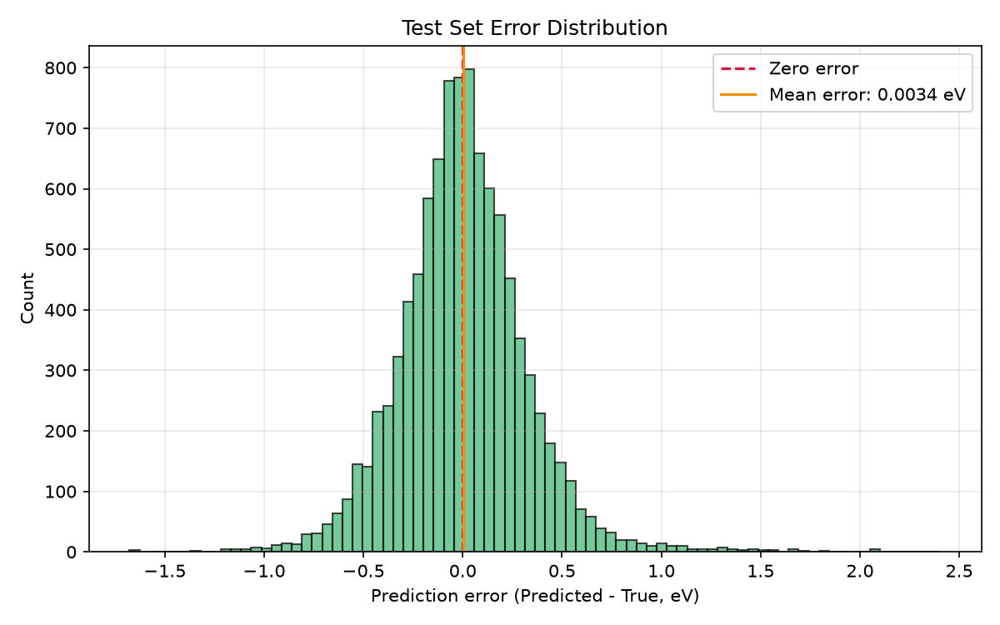

# QM9 HOMO-LUMO Gap Prediction — Message Passing Neural Network

A Graph Neural Network that predicts the HOMO-LUMO gap of small organic molecules directly from molecular structure — atoms as graph nodes, bonds as edges — trained on the QM9 quantum chemistry dataset.


---

## Table of Contents

- [1. Problem Statement](#1-problem-statement)
- [2. Dataset](#2-dataset)
- [3. Why a Graph Neural Network](#3-why-a-graph-neural-network)
- [4. Model: Message Passing Neural Network](#4-model-message-passing-neural-network-mpnn)
- [5. Training](#5-training)
- [6. Results](#6-results)
- [7. Project Structure](#7-project-structure)
- [8. Setup](#8-setup)
- [9. Usage](#9-usage)
- [References](#references)

---

## 1. Problem Statement

Given a molecule represented as a graph $G = (V, E)$, where each atom is a node $v \in V$ with a feature vector $x_v \in \mathbb{R}^{11}$ (atomic number, hybridization, charge, aromaticity, etc.) and each chemical bond is an edge $e_{vw} \in E$ with a feature vector $x_{vw} \in \mathbb{R}^{4}$ (bond type: single / double / triple / aromatic), predict a scalar quantum-chemical property $y(G) \in \mathbb{R}$.

**Target property:** the HOMO-LUMO gap,

$$
\Delta\varepsilon = \varepsilon_{\text{LUMO}} - \varepsilon_{\text{HOMO}}
$$

the energy difference between a molecule's Highest Occupied Molecular Orbital and Lowest Unoccupied Molecular Orbital. This gap is one of the most chemically meaningful and widely benchmarked QM9 targets: it governs a molecule's optical absorption onset, chemical reactivity, and electronic stability, and it appears as a standard benchmark in nearly every major molecular GNN paper (Gilmer et al. 2017; Wu et al. 2018; Klicpera et al. 2020).

### Molecules as Graphs

Every molecule is converted into a graph before it reaches the network. Atoms become nodes carrying an 11-dimensional feature vector; bonds become edges carrying a 4-dimensional one-hot bond-type vector. As a concrete example, ethanol ($\text{CH}_3\text{CH}_2\text{OH}$) maps to:



Each node's feature vector encodes atomic number, formal charge, hybridization, aromaticity, and whether the atom is a hydrogen-bond donor or acceptor. Each edge's feature vector one-hot encodes bond order (single / double / triple / aromatic). The network never sees SMILES strings or 2D coordinates directly — only this graph structure plus 3D atomic positions (`pos`) used for auxiliary distance-based features.

---

## 2. Dataset

**QM9** (Ramakrishnan et al., 2014, *Scientific Data*) contains 133,885 small organic molecules (up to 9 heavy atoms: C, N, O, F, plus attached hydrogens), each with 19 computed quantum-chemical properties from DFT calculations at the B3LYP/6-31G(2df,p) level of theory.

- **Molecules used:** 130,831 (after RDKit sanitization filters out a small number of structures that fail geometry consistency checks — the standard filtered count used across the literature)
- **Split:** 85% train (111,206) / 7.5% validation (9,812) / 7.5% test (9,813), fixed random seed (42) for reproducibility
- **Target statistics** (training set): mean = 6.858 eV, std = 1.283 eV



---

## 3. Why a Graph Neural Network

Molecules are naturally graphs, not fixed-size vectors or images. A GNN respects two structural properties a standard MLP or CNN would have to learn from scratch (if it could learn them at all):

- **Permutation invariance** — atom ordering in the input shouldn't affect the prediction. A GNN's message-passing and pooling operations are invariant to node permutation by construction.
- **Variable size** — molecules have different numbers of atoms and bonds. A GNN operates over arbitrary graph topology natively.

---

## 4. Model: Message Passing Neural Network (MPNN)

Following Gilmer et al. (2017), *"Neural Message Passing for Quantum Chemistry"* — the paper that established the MPNN framework and QM9 as its standard benchmark.

### Architecture Overview



### 4.1 Node embedding

Each atom's raw feature vector is projected into a hidden representation:

$$
h_v^{(0)} = \text{ReLU}\left(W_{\text{embed}} \, x_v + b_{\text{embed}}\right), \quad h_v^{(0)} \in \mathbb{R}^{64}
$$

### 4.2 Edge-conditioned message passing

For $T = 3$ message-passing steps, each node aggregates messages from its neighbors, where the transformation applied to each neighbor's hidden state is *conditioned on the bond type* connecting them:

$$
m_v^{(t+1)} = \frac{1}{|\mathcal{N}(v)|}\sum_{w \in \mathcal{N}(v)} A(x_{vw}) \, h_w^{(t)}
$$

where $A(x_{vw})$ is a learned function (a small MLP, the "edge network") mapping the 4-dimensional bond-type feature to a full $64 \times 64$ weight matrix. This is the key idea of edge-conditioned convolution (`NNConv`): a single/double/triple/aromatic bond each induces a *different* linear transformation on the message passed along it, so the network can learn that, e.g., aromatic bonds propagate electronic information differently than single bonds.

### 4.3 Recurrent node update (GRU)

Rather than updating node states with a simple MLP, the MPNN framework uses a Gated Recurrent Unit, treating each message-passing step as one step in a sequence:

$$
h_v^{(t+1)} = \text{GRU}\left(m_v^{(t+1)}, \, h_v^{(t)}\right)
$$

This recurrent formulation was shown in the original paper to stabilize training across multiple message-passing steps, compared to a plain feedforward update.

### 4.4 Readout: Set2Set pooling

After $T$ rounds of message passing, the per-atom hidden states must be pooled into a single graph-level embedding. Simple mean or sum pooling treats all atoms identically; instead, we use **Set2Set** (Vinyals et al., 2015), an LSTM-based iterative attention mechanism over the set of atom embeddings:

$$
\{h_v^{(T)}\}_{v \in V} \;\longrightarrow\; z_G \in \mathbb{R}^{128}
$$

Set2Set performs several "processing steps" of attention over the atom set, producing a $2 \times 64 = 128$-dimensional graph embedding that can weight structurally or chemically important atoms more heavily than a flat average would.

### 4.5 Output head

$$
\hat{y}(G) = W_2 \, \text{ReLU}(W_1 z_G + b_1) + b_2
$$

a two-layer MLP mapping the graph embedding to the (normalized) predicted HOMO-LUMO gap.

**Total trainable parameters:** 8,490,817

---

## 5. Training

- **Loss:** Mean Squared Error on standardized targets $\tilde{y} = (y - \mu)/\sigma$, where $\mu, \sigma$ are computed from the *training set only* (computing them from the full dataset would leak validation/test information into the normalization).
- **Optimizer:** Adam, initial learning rate $10^{-3}$
- **LR schedule:** `ReduceLROnPlateau` — halve the learning rate after 5 epochs without validation MAE improvement
- **Gradient clipping:** global norm clipped to 5.0 (recurrent GRU updates across multiple message-passing steps can occasionally produce large gradients early in training; clipping prevents these rare batches from destabilizing the run)
- **Early stopping:** halt after 15 epochs without validation MAE improvement
- **Batch size:** 128
- **Hardware:** NVIDIA RTX 4060 Laptop GPU (8 GB VRAM), ~105–120s/epoch

**Note on units:** QM9's target properties are provided by PyTorch Geometric already converted from Hartree (atomic units) to eV internally during dataset processing. All losses and metrics in this project are computed/reported in eV, the unit standard across the benchmark literature.

---

## 6. Results

> **Note on training status:** the results below come from a checkpoint saved at **epoch 2** of the training schedule (`checkpoints/best_model.pt`, `results/training_history.json`). The validation MAE at that point was still dropping fast — 0.317 eV after epoch 1, 0.281 eV after epoch 2 — with no sign of plateauing, so these numbers are a lower bound on the architecture's eventual performance rather than its converged accuracy. A full run to convergence (or early stopping) is expected to land much closer to the literature benchmarks in the comparison table below.

| Metric | Value |
|---|---|
| Best validation MAE (epoch 2) | 0.2811 eV |
| Test MAE | 0.3049 eV (304.9 meV, 0.011206 Hartree) |
| Test RMSE | 0.4357 eV |
| Checkpoint epoch | 2 |

### Comparison to literature (HOMO-LUMO gap MAE)

| Method | MAE |
|---|---|
| Gilmer et al. 2017 (MPNN, this architecture family) | ~117 meV |
| Wu et al. 2018 (MoleculeNet, method-dependent) | ~60–100 meV |
| Klicpera et al. 2020 (DimeNet, specialized directional GNN) | ~33 meV |
| **This model (epoch 2 checkpoint, pre-convergence)** | **304.9 meV** |

### Plots







---

## 7. Project Structure

```
gnn-qm9-drug-discovery/
├── config.py       # Hyperparameters, paths, target index, unit conventions
├── dataset.py      # QM9 loading, train/val/test split, target normalization
├── model.py        # MPNN architecture (NNConv + GRU + Set2Set)
├── train.py        # Training loop, early stopping, checkpointing
├── evaluate.py     # Test-set evaluation, literature comparison
├── visualize.py    # Training curves, predicted-vs-true, error distribution
└── README.md
```

Each file is independently runnable via `python <file>.py` and contains its own self-test in `if __name__ == "__main__":`.

---

## 8. Setup

```powershell
python -m venv venv
venv\Scripts\activate
pip install torch torchvision torchaudio --index-url https://download.pytorch.org/whl/cu126
pip install torch_geometric
pip install rdkit numpy matplotlib
```

## 9. Usage

```powershell
python dataset.py     # sanity-check data pipeline
python model.py       # sanity-check model forward/backward pass
python train.py       # full training run (~2-3 hours on RTX 4060)
python evaluate.py    # test-set evaluation
python visualize.py   # generate result plots
```

---

## References

1. Gilmer, J., Schoenholz, S. S., Riley, P. F., Vinyals, O., & Dahl, G. E. (2017). Neural Message Passing for Quantum Chemistry. *ICML*.
2. Ramakrishnan, R., Dral, P. O., Rupp, M., & von Lilienfeld, O. A. (2014). Quantum chemistry structures and properties of 134 kilo molecules. *Scientific Data*, 1, 140022.
3. Vinyals, O., Bengio, S., & Kudlur, M. (2015). Order Matters: Sequence to sequence for sets. *arXiv:1511.06391*.
4. Wu, Z., et al. (2018). MoleculeNet: a benchmark for molecular machine learning. *Chemical Science*, 9(2), 513-530.
5. Klicpera, J., Groß, J., & Günnemann, S. (2020). Directional Message Passing for Molecular Graphs. *ICLR*.
